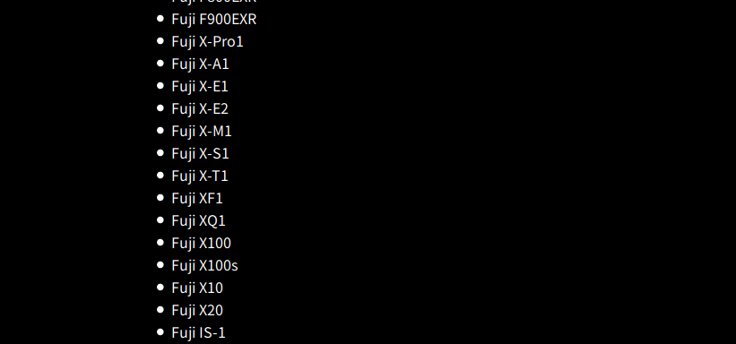
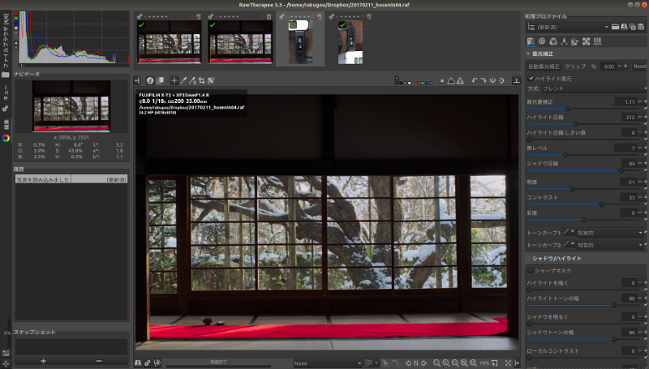
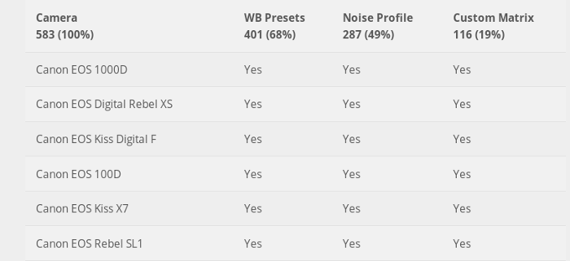
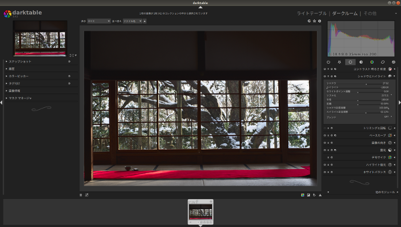

```{r setup, include=FALSE}
knitr::opts_chunk$set(echo = FALSE)
```

```{r initialize, include = FALSE, warning = FALSE}
fig.width = 800
```

#はじめに

##自己紹介
* Rakugou
* Ubuntuのカジュアルユーザー
* 使用カメラ：X-T2
* ざっぱ〜ん

## X-T2はいいぞ
* 軍艦部で露出設定がひと目でわかる
* フィルムシミュレーションがきれい
* フォーカスレバーが便利
* 防塵・防滴
* [X-H1もいいぞ](http://fujifilm.jp/personal/digitalcamera/x/fujifilm_x_h1/)

#Ubuntu 18.04 LTS リリースおめでとうございます。

# RAW画像とは

## RAW is 何
* JPEG画像を生成する元となる「生の(RAW)」データ
* メーカー、カメラによって形式、中身がまちまち
    + 富士フィルム：.raf
    + Canon：.tif .crw .cr2
    + Nikon：.nrw
    + Sony：.arw
* 拡張子が同じであってもカメラが違えば取り扱えるかどうかが変わってくる。

# X-T2のRAW画像はUbuntuでは取り扱えるの？
## UFRaw

[http://ufraw.sourceforge.net/Cameras.html](http://ufraw.sourceforge.net/Cameras.html)

* X-T2は非対応

## RawTherapee

> RawTherapee supports most raw formats, (中略) If you're wondering whether it supports your camera's raw format, first download RawTherapee and try for yourself.

* [https://rawpedia.rawtherapee.com/Supported_Cameras](https://rawpedia.rawtherapee.com/Supported_Cameras)

##現像できました



## darktable
* ソフトウェアセンターからダウンロード
* X-T2はCustom Matrixのみ非対応
* サポートしているカメラ（一部抜粋）

[https://www.darktable.org/resources/camera-support/](https://www.darktable.org/resources/camera-support/)

## 現像に成功


## 注意点
* darktableでの現像に成功したのはUbuntu 18.04 LTS
RawTherapeeのバージョンは5.3
darktableのバージョンは2.4.2-1

* Ubuntu 16.04 LTSではファイルを読み取ってくれなかった
RawTherapeeのバージョンは4.2.0
darktableのバージョンは2.0.3


# 他のやり方は？

## 虎穴に入らずんば虎子を得ず
1. Adobeの軍門に下る
2. 現像ソフトをWineで利用する
3. ~~カメラを買い替える~~

## Adobeの軍門に下る
* Adobe DNG Converter
* 各社のRAWファイルをDNGファイルに変換する
* DNGであれば取り扱える

```{r dng-pass, eval=TRUE, echo=FALSE}
library(DiagrammeR)
grViz("digraph dot{
      graph[rankdir = LR]

      node[fixedsize = TRUE]
      raf;
      nrw;
      arw;
      dng;
      node[shape = rectangle, fixedsize = false]
      UFRaw;
      RawTherapee;
      darktable;

edge[]
raf -> dng
nrw -> dng
arw -> dng
dng -> UFRaw
dng -> RawTherapee
dng -> darktable
      }")

```

## 現像ソフトをWineで起動する

* SILKYPIX
    * 起動しませんでした

* X RAW Studio
    * [https://fujifilm-x.com/jp/x-stories/fujifilm-x-raw-studio-features-users-guide/](https://fujifilm-x.com/jp/x-stories/fujifilm-x-raw-studio-features-users-guide/)
    * カメラ内現像をパソコンから行う
    * Windows版はまだ出ていません

## カメラを買い替える
* UFRawやdarktableに対応しているカメラを購入する
* 富士フィルムであればX-T1、X-Pro1くらいなら対応している(2014年モデルあたり)
* ロングセラー商品が狙い目っぽい
* 中古カメラ物色が捗りますね！
